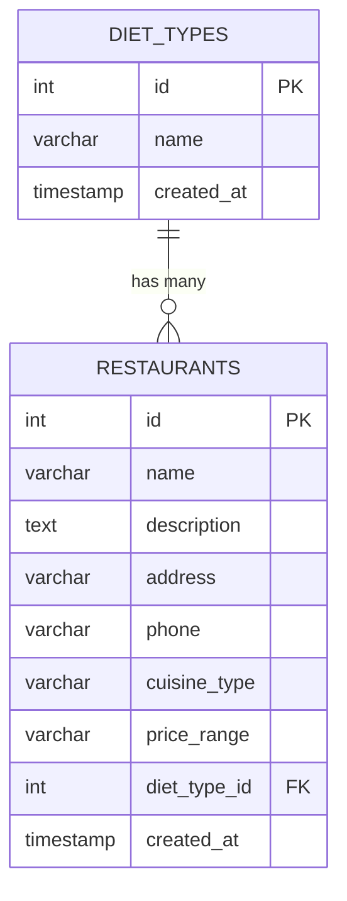

# Database Diagram

KindTable's database has two related tables: `diet_types` and `restaurants`. Each restaurant belongs to exactly one diet type, and one diet type can have many restaurants (one-to-many relationship), enforced by a foreign key.

- **PK** = Primary key
- **FK** = Foreign key (`restaurants.diet_type_id` references `diet_types.id`)
